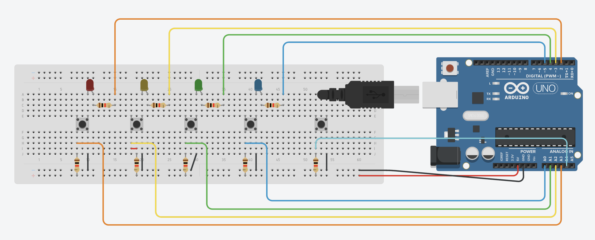

# Arduino Whack-a-Mole/Simon

## About
As co-leader of my high school’s Engineering Team, we decided to give the members an Arduino challenge after having first taught them the basics. The challenge was to code either Whack-a-Mole or Simon given a circuit and some pseudocode. This repository contains the circuit and the actual code I used when demonstrating the games to all the club members, and it allows anyone to access this fun project regardless of their reason. If you like these games or found this repository helpful, I would appreciate if you starred it or even shared it with your friends.

## Circuit
The circuit is the same for both games. It uses four different colored LEDs that are associated with four buttons, and it has a separate fifth start button. All LEDs and buttons are in series with their own resistor. I think that the way the circuit works is quite clever in that there are basically two separate loops, one for the LED, and one for the button, but they overlap because of the way the buttons work. Each LED is always in a closed circuit since the "right side" of the push button is connected, so to turn it on, the corresponding digital pin just needs to be set to `HIGH`. As for the button, when it is pressed, an increase in voltage can be read from the corresponding analog pin. The state of the button does not interfere with the status of the LED.

## Materials
- 1 Arduino Uno
- 5 Push buttons
- 9 1kΩ resistors
- 1 Full sized breadboard
- Various jumper wires
- 1 9V Battery (optional) 
- 1 [9V Connector](https://www.amazon.com/Chanzon-Battery-2-1x5-5mm-Connector-Leather/dp/B083QFNY1G?th=1) (optional)

## Instructions
Build the circuit based on the diagram below this section. I would recommend first putting the LEDs, buttons, and resistors on the breadboard before connecting all the jumper wires. Also, pay attention to the polarity of the LEDs, otherwise they will not light up. The positive end (longer pin) needs to be in the same column as the resistor, and the negative end needs to be in the same column as the button. The orientation of the resistors does not matter, and just make sure the buttons span the gap on the breadboard. Once the circuit is finished, upload the game of your choice and have fun playing it. Optionally, power the Arduino with a 9V battery using the connector.

## Games

### Whack-a-Mole
In this game, one of four LED lights up randomly, and the player must press the corresponding button within a set time limit to “whack” it. If the player succeeds, they have less time for the next one, but if they don't press the button in time or press the wrong button, the game ends by flashing all four LEDs.

### Simon
In this game, the player watches a random sequence of LEDs light up and then tries to repeat the sequence by pressing the corresponding buttons. With each level, the sequence grows longer and is shown faster, testing the player’s memory. When the correct sequence is entered, all LEDs will flash once, and if at any point it is entered incorrectly, all LEDs will flash three times.  

## Notes

### Complexity
Simon is slightly more complicated since it uses arrays, but the code for both games is about equal in length and has a very similar structure. 

### Tinkercad
If you do not have all the required materials, but would still like to build the circuit and play either game, I would recommend checking out [Tinkercad](https://www.tinkercad.com/). You can create a free account, build the circuit digitally, and then actually run the code. I actually used it to make the circuit diagram and test everything out before building it in real life. 

### Button Presses
To detect button presses, the code uses `while loops` when the game is active. When the game is not active, it just uses an `if-statement` inside the `loop` function that is constantly checking the button state, effectively mimicking a `while loop`. If the Arduino is hooked up to a computer, while the game is not active, there will also be a repeating message in the Serial Monitor telling the player to press the start button to begin.

## Contributors
Sachin Agrawal: I'm a self-taught programmer who knows many languages and I'm into app, game, and web development. For more information, check out my website or Github profile. If you would like to contact me, my email is [github@sachin.email](mailto:github@sachin.email).

## License
This package is licensed under the [MIT License](LICENSE.txt).